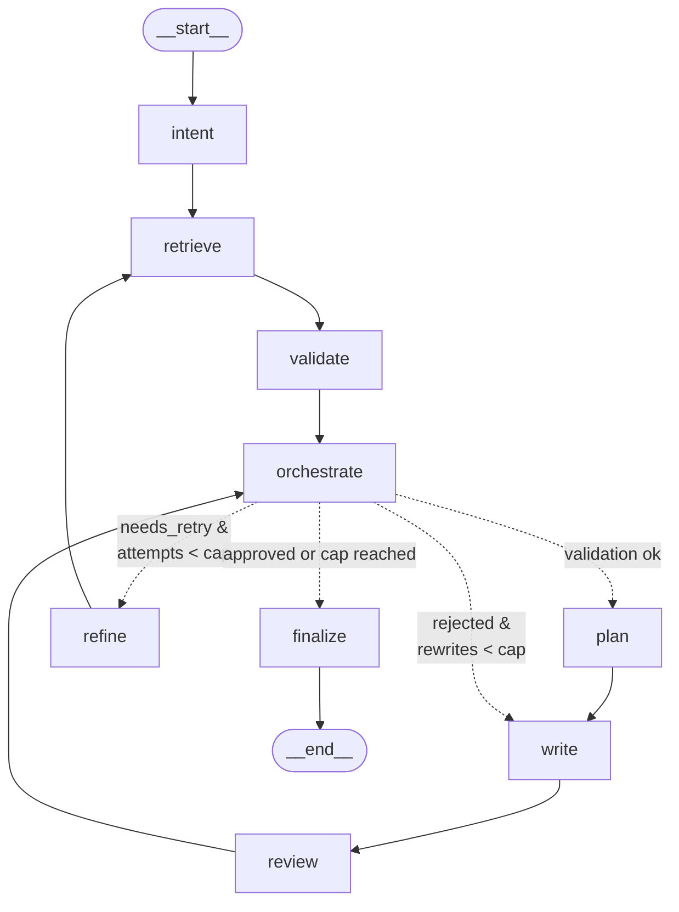

# Agentic Customer Support Email System

A multi-agent customer support system that turns an inbound email into a grounded,
reviewed reply. A LangGraph workflow coordinates specialized agents through a
**shared state**, with a deterministic orchestrator that drives two bounded
recovery loops (retrieval retry and response rewrite) so mistakes are caught and
corrected mid-workflow instead of reaching the customer.

The pipeline is a state-driven flow with two bounded recovery loops. The
**orchestrator** is consulted at the two branching points (after validation and
after review) and dispatches the next step from the shared state. Solid arrows are
fixed hand-offs; dotted arrows are the orchestrator's conditional dispatches —
labels show the condition that triggers each.



`finalize` publishes the approved draft when the review passed, or escalates with a
holding reply (and sets `needs_human_review`) when the review failed after the
rewrite cap — the *escalation* path is the "cap reached" branch above.

- **Retrieval retry loop:** the validator scores retrieved documents; on
  `needs_retry`, the refiner re-examines the email — correcting the intent if it
  was misclassified — and generates new queries before retrying. Bounded by
  `MAX_RETRIEVAL_ATTEMPTS`.
- **Response rewrite loop:** if the reviewer rejects, the writer revises using
  the feedback and the reviewer re-checks. Bounded by `MAX_REWRITE_ATTEMPTS`.
- **Safety:** after the rewrite cap, an unapproved draft is **not sent** — the
  workflow returns a holding reply and flags the case for human review.

> The compiled LangGraph topology is
> available at [`docs/architecture.png`](docs/architecture.png) /
> [`docs/architecture.mmd`](docs/architecture.mmd). Regenerate with
> `python scripts/export_graph.py` after changing the graph.

## Tech stack

- **LangGraph / LangChain** — workflow graph, conditional edges, structured outputs
- **Groq** (`llama-3.3-70b-versatile`) — agent reasoning
- **FastEmbed** (`BAAI/bge-small-en-v1.5`) — local embeddings (Groq has no embeddings API)
- **FAISS** — local vector store
- **Streamlit** — UI / workflow inspector
- **Pydantic v2** — typed state and agent I/O

## How it works

- **Shared state.** A single typed `WorkflowState` is read and updated by every
  node — no passing strings between agents. Each step returns typed partial updates.
- **Orchestrator (decision-point routing).** A deterministic policy, `decide(state)`,
  is consulted at the two real branching points — after retrieval validation and
  after review — and chooses one of `{retry_retrieval, plan, rewrite, finish}`. The
  deterministic sequences between those points need no router. The orchestrator
  owns every routing decision; the agents never decide what runs next. Being pure
  logic, it is fully unit-tested and adds no token cost.
- **Retrieval recovery loop.** A validator grades whether the retrieved documents
  can answer the email. If not, a refiner re-examines the email — correcting the
  intent if it was misclassified — and generates new queries before retrying.
  Bounded by `MAX_RETRIEVAL_ATTEMPTS`.
- **Response recovery loop.** A reviewer checks the draft for grounding,
  completeness, consistency, and helpfulness. On rejection the writer revises using
  the feedback. Bounded by `MAX_REWRITE_ATTEMPTS`.
- **Safety.** If a draft is still unapproved after the maximum rewrites, it is
  **not sent** — the workflow escalates (returns a holding message and flags the
  case for human review). An unverified reply never reaches the customer.
- **Structured outputs.** Every agent returns a validated Pydantic model via
  `with_structured_output`, so there is no fragile JSON parsing.

## Prerequisites

- Python 3.10+
- A [Groq API key](https://console.groq.com/keys)

## Setup

```bash
# 1. Create and activate a virtual environment
python -m venv .venv
# Windows (PowerShell):
.venv\Scripts\Activate.ps1
# macOS / Linux:
source .venv/bin/activate

# 2. Install dependencies and the package (editable)
pip install -r requirements.txt
pip install -e .

# 3. Configure your API key
cp .env.example .env          # Windows: copy .env.example .env
# then edit .env and set GROQ_API_KEY=gsk_...
```

> The embedding model is downloaded locally by FastEmbed on first use (~130 MB),
> then cached. No key is required for embeddings.

## Usage

```bash
# 1. Build the vector index from the internal docs (run once, and after editing docs)
python scripts/build_index.py

# 2. Launch the app
streamlit run app.py
```

The app accepts a customer email, streams the workflow live (each agent step
appears as it runs), and shows the final reply alongside the retrieved documents,
plan, draft, review verdict, and full execution trace.

## Project layout

```
data/internal_docs/        Knowledge base (markdown)
scripts/build_index.py     Builds the FAISS index
src/support_agent/
  config.py  logger.py  exceptions.py   Foundations (settings, logging, errors)
  models/                  Enums, agent I/O schemas, shared WorkflowState
  llm/                     Chat client + centralized prompts
  rag/                     Document loader + FAISS vector store
  agents/                  Intent · Refiner · Retrieval · Validator · Planner · Writer · Reviewer
  workflow/                nodes (agent↔state), orchestrator (routing policy), graph (wiring)
app.py                     Streamlit UI
tests/                     Offline unit tests (routing, state, schemas, nodes, RAG)
```

## Configuration

Settings load from `.env` (see `src/support_agent/config.py`). Common options:

| Variable | Default | Purpose |
| --- | --- | --- |
| `GROQ_API_KEY` | — | Required for agent reasoning |
| `CHAT_MODEL` | `llama-3.3-70b-versatile` | Primary Groq chat model |
| `FALLBACK_CHAT_MODEL` | `openai/gpt-oss-120b` | Used automatically if the primary call fails (e.g. rate-limited) |
| `MAX_RETRIEVAL_ATTEMPTS` | `2` | Retrieval retry cap |
| `MAX_REWRITE_ATTEMPTS` | `2` | Response rewrite cap |

## Development

```bash
pip install -r requirements-dev.txt
pytest                      # tests (pure logic, no network)
ruff check .                # lint
mypy src                    # strict type-check
```
